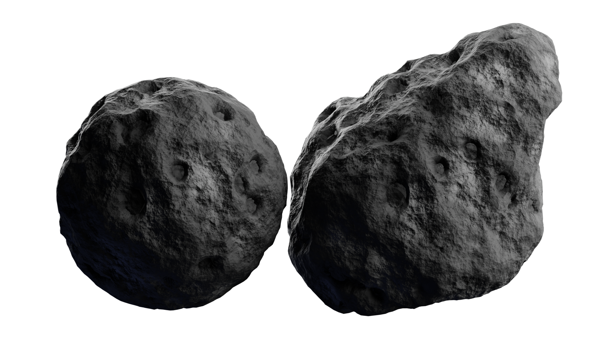

## Procedural Nodes for Textures and Dynamic Material Properties

**Author:** Elpida-Kalliopi D. Anthopoulou  
**Institution:** Democritus University of Thrace (DUTH)  
**Software Environment:** Blender 4.2  
**Documentation:** [Thesis PDF](thesis-report.pdf)

## Overview

This repository contains the official project files for the undergraduate thesis **"Procedural Nodes for Textures and Dynamic Material Properties"**. 

The main objective of this work is to explore fully procedural texturing within Blender using Shader Nodes. All materials in this repository are resolution-independent, parametric, and built entirely using mathematical functions, procedural textures (Noise, Voronoi, Wave), and PBR principles via the Principled BSDF node, without relying on external image textures.

## Material Gallery
<table>
  <tr>
    <td align="center" width="50%"><b>Aqua Marble</b></td>
    <td align="center" width="50%"><b>Asteroid</b></td>
  </tr>
  <tr>
    <td align="center"></td>
    <td align="center"></td>
  </tr>
  <tr>
    <td align="center"><b>Black Veined Marble</b></td>
    <td align="center"><b>Layered Rock</b></td>
  </tr>
  <tr>
    <td align="center"></td>
    <td align="center"></td>
  </tr>
  <tr>
    <td align="center"><b>Oxidized Bronze Metal</b></td>
    <td align="center"><b>Scratched Metal</b></td>
  </tr>
  <tr>
    <td align="center"></td>
    <td align="center"></td>
  </tr>
</table>

## Material Breakdown & Node Techniques

Each material is packaged into dedicated node groups with exposed parameters (color, scale, roughness, distortion):

1. **Aqua Marble:** Utilizes *Wave*, *Noise*, and *Voronoi* textures blended using *Mix (Linear Light)* nodes to generate procedural veins.
2. **Asteroid:** Employs *Voronoi (Distance to Edge)* and *Displacement* mapping to form organic impact craters and rugged surface details.
3. **Black Veined Marble:** Features crisp procedural veining using *Voronoi* distance calculations paired with custom *Map Range* remapping.
4. **Layered Rock:** Multi-layered *Noise* textures combined with *RGB Curves* for complex geological strata and heavy displacement.
5. **Oxidized Bronze Metal:** A PBR metallic setup integrating procedural corrosion layers via noise masks.
6. **Scratched Metal:** Procedurally generated surface scratches and dynamic anisotropy/roughness variation.

## Repository Structure

```text
blender-procedural-materials-thesis/
├── README.md              # Project documentation and gallery
├── thesis-report.pdf      # Complete thesis document (PDF)
└── materials/             # Material source files & render samples
    ├── Aqua Marble/
    ├── Asteroid/
    ├── Black Veined Marble/
    ├── Layered Rock/
    ├── Oxidized Bronze Metal/
    └── Scratched Metal/
```
## How to Use
1. **Clone** or **download** this repository: [blender-procedural-materials-thesis.git](https://github.com/elkathop-776/blender-procedural-materials-thesis.git)
2. Open any *.blend* file located inside the *materials/<Material_Name>/* directory using **Blender 4.2+**.
3. **Select** the *object* and *open* the **Shader Editor** tab to tweak the custom procedural parameters.
